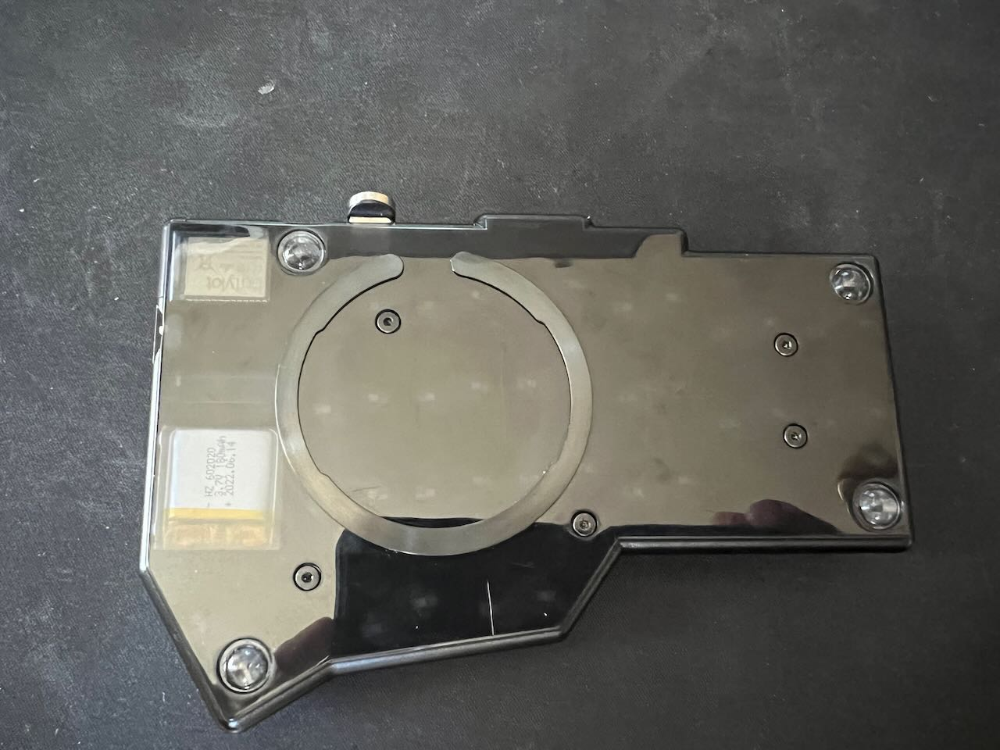

## Magnetic Keyboard Mounting/Tenting

### Parts
- [MagSafe continuity camera mount](https://www.amazon.com/dp/B0BRKPVPQR) which has a standard 1/4"-20 thread compatible with camera rigging gear
- [MagSafe ferromagnetic rings](https://www.amazon.com/dp/B09LQLZKSD) with adhesive backs that can be mounted on the bottom case of your keyboard
- [Manfrotto pocket tripods](https://splitkb.com/collections/keyboard-parts/products/manfrotto-pocket-tripod?variant=39254223814733) for standalone tenting
- [articulated arms](https://www.tackform.com/products/4-75-stud-arm-dual-20mm-ball-couplers-enduro-series) for mounting to other things, e.g. chair armrests

### Keyboard Preparation
Stick a ferromagnetic ring to the bottom of each keyboard half, choosing a spot where the weight is balanced, but avoiding any screws.

### Tripod Tenting
The tripod attaches to the continuity camera mount and the keyboard with ferromagnetic ring attaches to it. Adjust the angle with the tripod legs. Rotate the keyboard on the ring; the magnets are strong enough to keep it from moving inadvertently, but not so strong that you can't easily rotate it deliberately.

### Chair Mount
Attach an articulated arm to each armrest (this could be challenging or easy depending on your chair). Attach a continuity camera mount to the pole of each 20mm ball. Attach keyboard halves to mounts. Adjust angle with ball and socket joint. Rotate keyboard halves on rings.

