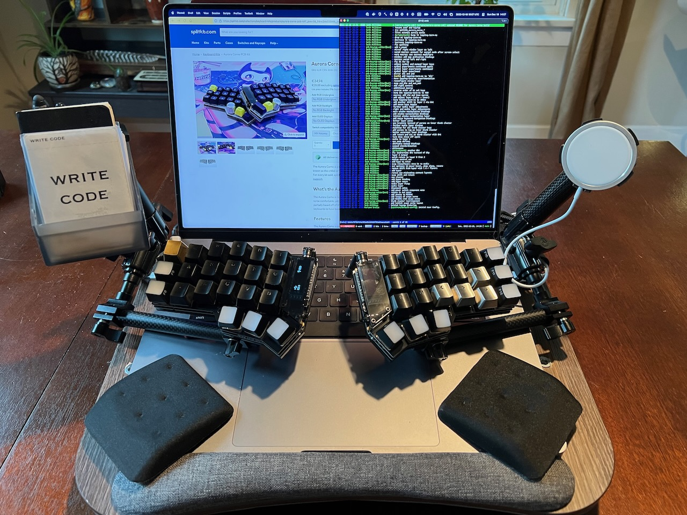
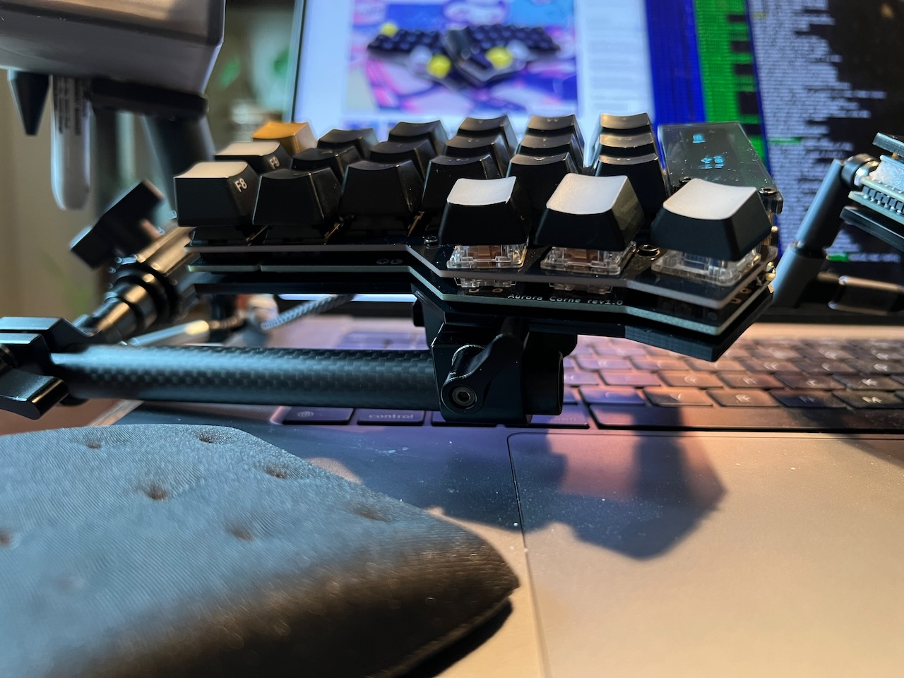
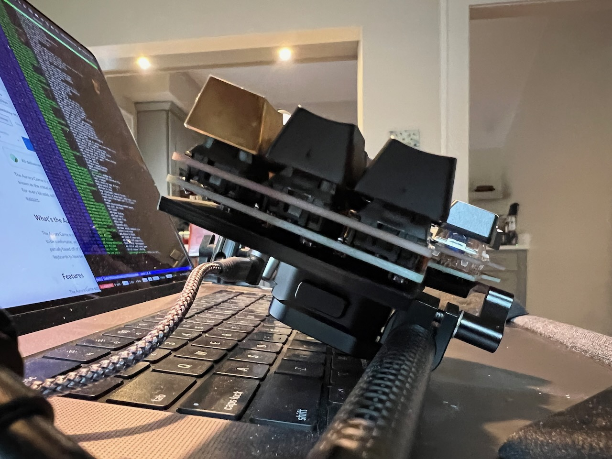
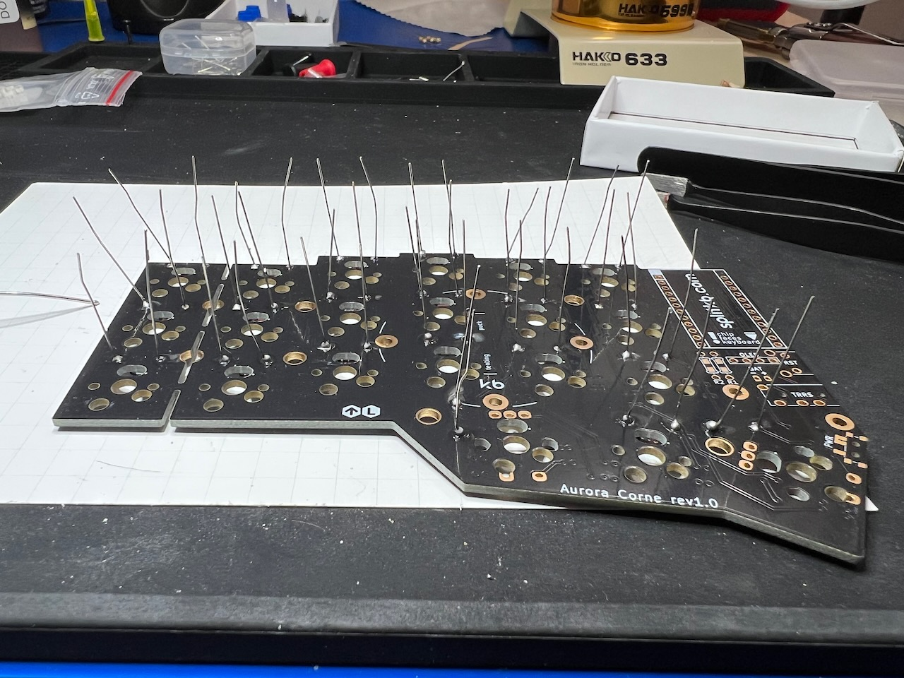
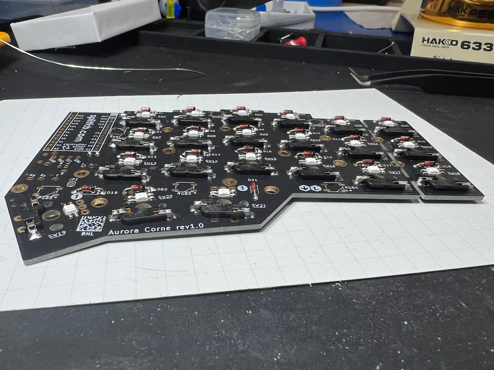
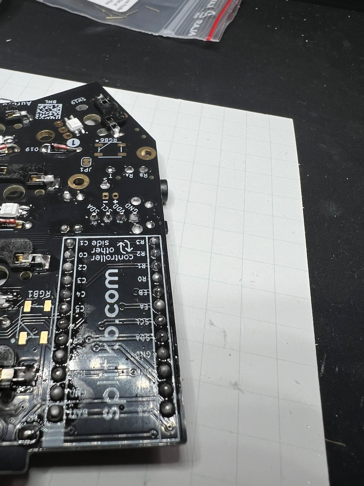
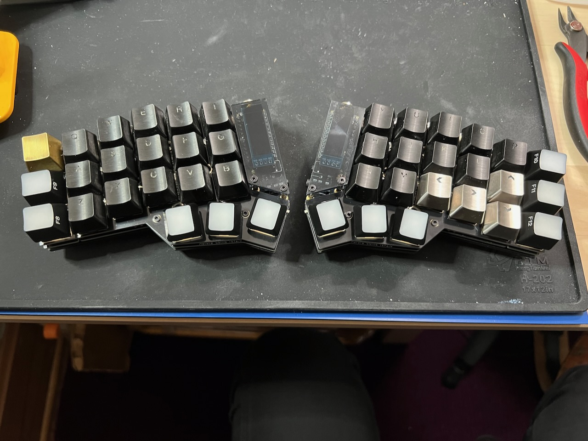

## Aurora Corne MX Hotswap Keyboard

### Backstory

After spending a couple months using (and loving) my pre-built [Swept Corne](https://github.com/SethMilliken/swept-corne-zmk/tree/seth) from Mariano Uvalle, I got the itch to try my hand at building my own keyboard. My primary motivation for going down this rabbit hole originated from the [Teamwolf stainless steel keycaps](https://drop.com/buy/teamwolf-stainless-steel-alpha-set-keycaps-v2?searchId=dd76bf4e17917301e79347352ee040c0) that I had been using on what had been my 
main keyboard for a year or so, a [Keychron K3](https://www.keychron.com/products/keychron-k3-wireless-mechanical-keyboard). I really, really liked the feel of those keycaps, but also knew that I was never again going back to any keyboard that was not a split ortho. The Swept Corne uses Choc v1 switches, though, which are incompatible with the stainless steel keycap MX stems. Another factor was that I also wanted to stick with a Bluetooth-capable board, since I find it incredibly valuable for giving me a near-instantaneous KVM switch between my laptop, desktop, phone, and iPad. This ruled out any other pre-built boards I could find, all of which use controllers that only support QMK firmware (which does not support Bluetooth). All of which meant that if I wanted this combination of features, I would have to do it myself.

So I started looking around for kits, and the [Aurora Corne](https://splitkb.com/collections/keyboard-kits/products/aurora-corne-pcb-kit) from splitkb.com stood out as a particularly well designed one. I could get it with a configuration that included support for hotswap MX switches, nice!nano controllers (for Bluetooth), as well as OLED displays and a nice case with an FR4 plate and acrylic bottom. It also had support for the [tenting puck](https://splitkb.com/products/tenting-puck), which is another feature high on my list of requirements, given the mounting setups I had already created for my Swept using quick release plates.

Insert montage here of me watching many YouTube videos, reasearching and buying soldering gear, developing rudimentary soldering skills using practice kits, scouring Discord chats for tips and guidance, finishing with the arrival of my kit order from splitkb.com.

### Build

After working through a half dozen practice kits, I decided I could solder well enough to make an attempt on the Aurora Corne kit and dedicated a weekend to finishing my build. The [build guide](https://docs.splitkb.com/hc/en-us/articles/6269789921564-Aurora-Build-Guide-Introduction) was great, walking through almost every step in the process, pointing out common problems, and clearly calling out caveats and optional steps (with only a few minor omissions overall). Having that well-written guide gave me a lot more confidence and significantly reduced the stress of doing my first buld.

The build process all went quite smoothly, with no major incidents. I used a [Pinecil v2](https://www.pine64.org/pinecil/) soldering iron, which was a pleasure to use (and incredibly affordable, given its capabilities). The most challenging part for me was soldering the LEDs, the smallest, most heat-sensitive components in the kit (and I still don't know whether these work because I don't think the ZMK firmware I am using supports them yet).

 Once I finished assembly, I tried plugging in the left half to USB and trying it out. Only about seven keys sent any characters at all, and the ones sent were the wrong ones. Also, the OLED screen did not work. I tracked these problems down to having reused the firmware configuration I had created for my Swept, having poorly reasoned that a Corne is a Corne, right? Nope. Once I updated the firmware build configuration to use the correct shield, I got a bit further. Now most keys worked, sending the correct characters for my keymap. But there were a couple keys that still did not work. One of these had a bent switch pin, fixed easily enough. I eventually figured out that the last remaining non-functional key resulted from having incorrect filenames for the `.keymap` and `.conf` files. Once I fixed this filename issue, not only did the key start working, but the OLED came to life as well. Meanwhile, the right half also had a couple of switches with bent pins, but worked fine otherwise.

At this point, I had a working keyboard. And remarkably, there were no soldering-related problems (or none that have shown up yet, at least).

### Use

Having already created a keymap for the Swept, along with the months of experience typing on that board, it was pretty easy for me adapt to typing on the Aurora Corne. The column stagger on the Swept is a lot greater than on the Aurora, which currently feels like the biggest adjustment I have to make when switching between them. The greater travel and actuation force of the MX switches is definitely a noticeable difference, too, but does not seem to have any affect on the accuracy of my typing. It is significantly easier to move between the different Corne boards than to go from either Corne to a traditional row-stagger board.

I am liking having the OLED screen even more than I thought I would. The connection indicator (i.e. USB or Bluetooth slot number) shores up one of the biggest problems I had with the Swept, which is uncertainty about what it is currently connected to. If there is ever any connection problem when switching devices, I can't tell until I start typing and see it sending to the device I had just been using. I also like the layer indicator, although that doesn't seem to have much practical value in everyday use.

### Keycaps

[Teamwolf stainless steel alpha keycaps](https://drop.com/buy/teamwolf-stainless-steel-alpha-set-keycaps-v2?searchId=dd76bf4e17917301e79347352ee040c0) with a set of arrow key cluster caps to fill out the main board keys. An artisan [machined C360 bronze OEM R4](https://www.etsy.com/listing/823240795/machined-brass-mx-keycap-oem-r4-esc) keycap for the upper left corner (a bit of an indulgence, but I absolutely love its heft). The thumb cluster and other outer pinky row keys are currently just placeholders while I await some [Asymplex DES Ergo](https://www.asymplex.xyz/product/des-ergo-caps) Corne thumb set and lateral alpha column keycaps.

### Switches

I opted for [Boba U4 Silent Tactile](https://ringerkeys.com/collections/switches/products/gazzew-boba-u4-silent-tactile-switches?variant=40184474042450) (68g) switches for most of the keys, with [Durok Dolphin Silent Linear](https://www.amazon.com/gp/product/B08G81RZL1) (62g) switches for the thumb cluster keys. I think I would prefer lighter switches, but the Boba switches have a satisfying tactile feel and are pretty quiet. So far I haven't experienced any fatigue from typing on them for a while, either.

### Miscellaneous

To reduce strain on the USB-C ports, I used the same [magnetic adapter tips](https://www.amazon.com/gp/product/B09YNKT2QS) I use for the Swept. This also contributes to the Swept and Aurora boards being completely interchangeable on my lap desk.

I had forgotten that ZMK currently does not support RGB except for underlighting, which I opted not to get for some reason, and so I won't know if my soldering on those components was effective either until ZMK adds support or I get a set of socketed Elite-C controllers and configure the board to work with QMK firmware.
